## 執行摘要

杰隆印刷是一家專業標籤貼紙印刷廠，擁有 7 色數位印刷與 8 色輪轉設備，並取得 ISO 9001 及 FDA 認證。其核心痛點在於：**散客詢價來回溝通耗時過長**（快則半天、慢則超過三天），導致因回應不及時而流失訂單。

本提案旨在以 **Asgard AI 平台的 Odin 工作流引擎** 為核心，搭配客製化前後端開發與基本 DB / AP Server，打造一套 **AI 自動接單 Chatbot**，讓中小型客戶能透過白話對話、圖檔上傳、AI 模擬圖預覽，在不需要印刷專業知識的情況下，**24 小時自助完成詢價到確認下單的全流程**。

**POC 目標**：在三週內上線可操作的 Demo，完整走完從「客戶第一句話」到「確認訂單內容」的核心對話流，並在訂單中確保材質選項僅限官網已提供之材料。

---

## 客戶現況與痛點

### 業務現況

| 面向 | 現況描述 |
|------|---------|
| 主要聯繫管道 | 網站表單、Email、LINE |
| 詢價到報價時間 | 快則半天，慢則超過三天（多次來回） |
| 目標客群 | 對印刷流程不熟悉的中小型業主 |
| 訂單欄位複雜度 | 共 45+ 個欄位（A 類必問 14 項、B 類條件 7 項、C 類內部 24 項） |
| 現有下單輔助 | 手動 Excel 訂單追蹤表 |
| 缺口 | 無自動化前端接單機制，全靠人力即時回應 |

### 核心痛點

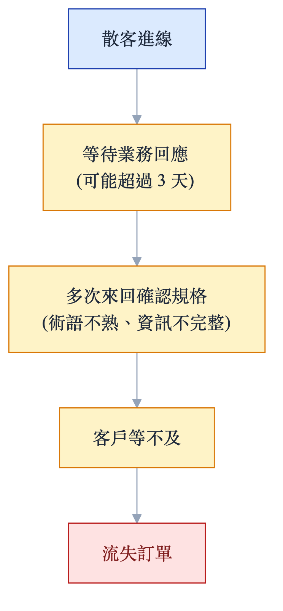{ width=40% }

1. **回應速度**：非上班時間、假日完全無法接案，尤其影響跨國跨時區客戶。
2. **溝通效率**：客戶不懂印刷術語（燙金、軋型、跳距），每次詢價都需要大量解釋。
3. **重複勞動**：業務人員需要對每個新詢價從零開始確認規格，即使是回頭客也常需重填。
4. **資訊漏失**：未被即時追蹤的詢價需求在交接或延誤中流失。

---

## 解決方案概覽

### 整體思路

以 **Asgard Odin 工作流引擎** 為核心，搭配客製化前後端與基本 DB / AP Server，對應業主從「接單」到「訂單成立」的完整流程：

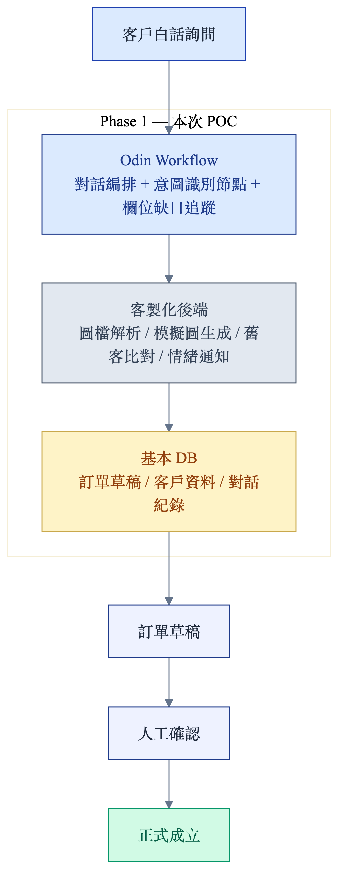{ width=55% }

### 本次採用技術與業主需求對應

| 業主需求 | 本次採用 | 說明 |
|---------|---------------|------|
| 零程式碼工作流設計 | **Odin** Workflow | 設計詢價流程、條件分支、轉接邏輯 |
| AI Chatbot 對話引導 | **Odin 工作流節點 + 客製化程式** | LLM 節點負責意圖識別、客製化程式做欄位缺口偵測與話術生成 |
| 訂單資料管理 | **客製化 DB + AP Server** | 訂單草稿、客戶資料、對話紀錄持久化 |
| 圖檔上傳解析 | Odin + LLM Vision | 解析設計稿色數、特殊工藝 |
| AI 模擬圖生成 | Odin + Image Gen | 貼標情境模擬圖輸出 |
| 舊客識別與帶入 | 客製化後端 + DB | 電話 / Email 比對歷史訂單 |
| 情緒偵測轉真人 | Odin LLM 節點 + 客製化通知 | 負面情緒觸發 Email / LINE 人工接管 |
| 多語言支援 | LLM（Claude / GPT） | 英文詢價自動翻譯處理 |
| LINE / 網頁雙管道 | Odin Webhook | 統一入口接收各管道訊息 |

---

## POC 範疇定義

### POC 包含（In Scope）

- [x] **網頁嵌入式 Chatbot**：可在杰隆官網嵌入的對話框
- [x] **詢價對話完整流程**：從開場到確認訂單草稿（A 類 14 項欄位全部收集）
- [x] **材質智能引導**：白話描述自動對應官網提供之 8 種材質
- [x] **圖檔上傳 + AI 解析**：上傳設計稿後解析色數、尺寸建議
- [x] **AI 貼標模擬圖生成**：依規格生成貼紙貼附於容器之情境圖
- [x] **舊客識別**：以 Email 或電話比對歷史訂單，帶入舊資料
- [x] **情緒偵測轉真人**：觸發後發送通知給業務（Email）
- [x] **訂單草稿輸出**：對話完成後輸出結構化訂單 JSON 供業務確認

### POC 不包含（Out of Scope）

- [ ] LINE 官方帳號整合（POC 後階段）
- [ ] 自動報價計算引擎（需杰隆提供定價邏輯）
- [ ] 與現有 ERP / 生產系統直接對接
- [ ] 匯款確認與開立發票自動化
- [ ] 完全無人工確認的全自動成立訂單

> **POC 邊界說明**：POC 階段由 AI 引導至完成訂單資訊確認，最終仍需業務人員確認此單是否能夠成立（材料庫存、生產排程）後，再通知客戶。

---

## 系統架構設計

### 四層架構

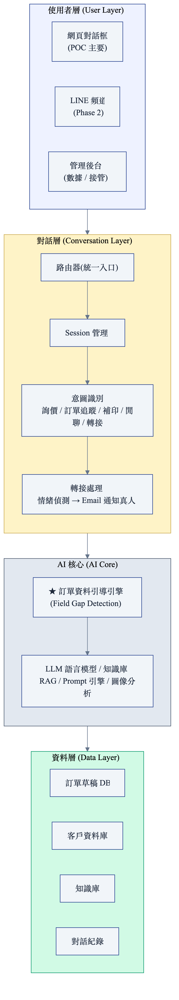{ width=72% }

### Asgard AI 工具映射到各層

| 架構層 | 本次採用 | 功能 |
|--------|--------------|------|
| 使用者層 | 客製化前端（React） | 嵌入式對話框、AI 模擬圖預覽 |
| 對話層 | Odin Workflow + Router | 意圖路由、Session 管理 |
| AI 核心 | Odin LLM 節點 + 客製化程式 | 欄位偵測、知識庫 RAG、模擬圖串接 |
| 資料層 | 客製化 DB + AP Server | 訂單資料、客戶識別、對話紀錄 |
| 通知機制 | Odin HTTP Node | Email / LINE Webhook |

---

## 核心功能規格

### 訂單資料引導引擎（Field Gap Detection）

這是系統的最核心元件，由 **Odin 工作流節點 + 客製化程式** 驅動，負責在每輪對話後：

1. **更新已填欄位清單**（從對話中提取結構化資訊）
2. **判斷下一個最重要的缺口**（A 類優先、B 類條件觸發）
3. **生成白話追問**（不使用印刷術語）

```
對話狀態追蹤 JSON 範例：

{
  "session_id": "sess_abc123",
  "customer": { "phone": null, "email": "client@example.com", "is_returning": false },
  "collected_fields": {
    "品名": "保養品正標",
    "尺寸": "50x80mm",
    "數量": 2000,
    "材質": "亮面珠光",    ← 已對應至官網材質
    "成捲單張": null,       ← 下一個要問的 A 類欄位
    "色數": null,
    "是否軋型": null,
    ...
  },
  "next_question": "這批貼紙要裁成一張一張，還是捲成一卷方便機器自動貼呢？",
  "completion_rate": 4/14
}
```

### 白話引導對話腳本

| 對話階段 | 客戶輸入（示例） | AI 回應策略 | 背後動作 |
|---------|--------------|------------|---------|
| **開場** | 「請問印一張多少錢」 | 「您好！各種標籤工法不同，可以告訴我您大概想做什麼樣的貼紙嗎？」 | 建立 Session，偵測舊客 |
| **開場** | 「我要印 4000 張，多少錢」 | 「謝謝您！每款貼紙工法不同所以價格不同，我先幫您整理規格再報價，可以嗎？」 | 意圖識別：詢價，啟動欄位收集 |
| **舊客** | 電話/Email 比對到歷史訂單 | 「歡迎回來！上次您訂的是『XX酒標』2000 張亮面珠光。這次要補印同款嗎？」 | 帶入舊欄位，只問差異 |
| **材質** | 「要那種有光澤感的」 | 「您說的光澤感，是像鏡面那種亮亮的（亮面珠光），還是比較低調的霧面感（霧面珠光）？」 | 口語對應至官網材質選項 |
| **材質** | 「要銀色金屬感的」 | 「銀色金屬感我們有兩種：亮銀龍（像鏡子一樣反光）或反銀龍（相對低調的銀色），您比較喜歡哪種呢？」 | 提供官網兩種選項讓客戶決定 |
| **尺寸** | 「大概名片大小」 | 「名片大小大約是 9x5 公分，您的貼紙是這個尺寸嗎？還是有需要微調？」 | 換算常識尺寸 |
| **圖檔** | 上傳設計稿 | 「我幫您分析一下……您的設計有 4 個顏色（CMYK），沒有看到需要特殊燙金的部分，確認嗎？」 | LLM Vision 解析色數 |
| **無理要求** | 「你給我便宜一點」 | 「了解您希望有好的價格！讓我先把規格確認完整，再幫您算出最優惠的方案。」 | 情緒偵測，維持引導 |
| **成捲方向** | 「要成捲」 | 「好的，成捲的話貼紙出紙方向請問是正捲右出、正捲左出，還是您不確定？（如果不確定我可以說明）」 | B 類欄位觸發：捲向 |
| **燙金觸發** | 「設計有金色反光效果」 | 「有需要燙上金色反光效果的話，大概是在設計的哪個位置呢？」 | B 類欄位觸發：燙金 |
| **完成確認** | 全欄位收集完畢 | 「我幫您整理一下需求確認：品名 XX｜尺寸 50x80mm｜數量 2000 張｜材質 亮面珠光｜……這些資訊正確嗎？確認後我們會盡快提供報價！」 | 輸出訂單草稿 JSON |

### 材質選項（嚴格對應官網）

> ★  訂單確認時，AI 只能提供以下 8 種材質選項，不得推薦官網未列出的材料。

| 材質名稱 | 特性描述 | 適合場景 | AI 白話說法 |
|---------|---------|---------|------------|
| **銅版紙** | 光滑平面，CP值高 | 一般標籤、預算考量 | 「最基本款，價格實惠，表面光滑」 |
| **亮面珠光** | 色彩表現佳，防水、撕不破 | 保養品、飲料、禮品 | 「光澤感強，色彩鮮豔，防水耐用」 |
| **霧面珠光紙** | 質感佳，消光效果，防水 | 精品、美妝、高端酒標 | 「低調質感，霧面不反光，同樣防水」 |
| **亮銀龍貼紙** | 防水、抗刮，鏡面表面 | 電子產品、金屬質感需求 | 「鏡面銀色，像不鏽鋼一樣的質感」 |
| **反銀龍貼紙** | 防水、抗刮，鏡面表面 | 工業標籤、耐久性需求 | 「銀色但較低調，同樣防水抗刮」 |
| **模造紙** | 非塗佈紙，吸墨強，無光澤 | 手寫標籤、有機風格 | 「無光澤、自然質感，墨水吸收好，可書寫」 |
| **透明標籤** | 防水、抗刮、撕不破，透明 | 瓶罐透視設計 | 「貼上去幾乎看不到底材，像直接印在容器上」 |
| **日本和紙** | 質感顯著，質地特殊，紋路多樣 | 高端禮品、清酒標、文創 | 「有獨特紙感和紋路，非常有質感，適合精品」 |

**AI 材質引導決策樹**：

```
客戶描述 → AI 對應材質
─────────────────────────────────────
「要防水」              → 亮面珠光 / 霧面珠光 / 透明 / 亮銀龍 / 反銀龍
「要有光澤」            → 亮面珠光
「要霧面/低調」         → 霧面珠光紙
「要銀色/金屬感」        → 亮銀龍（鏡面）/ 反銀龍（霧面銀）
「要透明/隱形」         → 透明標籤
「要自然/有機感」        → 模造紙 / 日本和紙
「要高端質感/精品感」    → 日本和紙 / 霧面珠光紙
「預算考量/一般標籤」    → 銅版紙
─────────────────────────────────────
若描述模糊 → 追問：「您的貼紙主要用在什麼產品上、貼在什麼材質的容器上呢？」
```

### AI 貼標模擬圖生成

當 A 類欄位收集至 50% 以上，AI 主動詢問：「要不要先看看貼在產品上的模擬效果圖呢？」

**輸入（從收集欄位中提取）**：

| 輸入維度 | 說明 | 來源欄位 |
|---------|------|---------|
| 設計稿圖 | 客戶上傳的印刷用圖 | 圖檔上傳 |
| 貼紙尺寸 | 寬 x 高 (mm) | 尺寸欄位 |
| 貼紙形狀 | 長方形 / 圓形 / 異形 | 是否軋型 |
| 材質類型 | 對應官網 8 種材質 | 材質欄位 |
| 表面加工 | 亮膜 / 霧膜 | 亮/霧膜欄位 |
| 特殊工藝 | 燙金 / 打凸 | B 類條件欄位 |
| 容器類型 | 從品名推斷（保養品→壓頭瓶、酒→酒瓶等） | 品名 + 對話 NLP |
| 使用場景 | 電商白底 / 貨架陳列 / 禮品 | 對話中詢問 |

**容器類型對應（自動推斷）**：

| 品名關鍵字 | 推斷容器 |
|-----------|---------|
| 洗髮精、沐浴露、洗手乳 | 立式壓頭瓶 |
| 紅酒、葡萄酒 | 深綠色長頸玻璃瓶 |
| 威士忌 | 琥珀色圓肩玻璃瓶 |
| 清酒 | 透明/磨砂長頸玻璃瓶 |
| 啤酒 | 啤酒瓶/罐 |
| 保健食品、膠囊 | 白色圓罐 |
| 藥品 | 棕色遮光瓶 |
| 禮盒 | 天地蓋禮盒 |
| 貼紙（一般） | 電商白底平面圖 |

**輸出**：
- 低解析度預覽圖（含浮水印）
- 角度：正面平視 / 45° 斜角（預設）/ 俯視（flat lay）
- 提示：「這是模擬效果圖，實際印刷效果以打樣為準」

### 舊客識別機制

```
客戶輸入聯繫資訊（電話 / Email）
         ↓
客製化 DB 客戶資料比對
         ↓
     ┌───────────────────┐
     │                   │
  找到舊資料          未找到
     ↓                   ↓
  比對訂單時間          建立新客戶資料
     ↓
  ┌─────────────┬──────────────────┐
  │             │                  │
 一年以內     超過一年          無訂單記錄
  ↓             ↓
帶入所有欄位   帶入欄位但       建立新詢價
只確認差異     全部重新確認
```

### 人工轉接觸發條件

以下任一條件觸發後，AI 停止主動推進，改為收集資訊並通知業務介入：

| 觸發條件 | 觸發動作 |
|---------|---------|
| 連續 2 次出現負面情緒語句 | 發送 Email 通知業務，保留完整對話紀錄 |
| 報價金額超過人工設定門檻 | 轉交業務進行議價 |
| 材質需求超出官網 8 種材質 | 告知客戶需人工評估，轉接業務 |
| 尺寸或規格超出生產範圍 | 告知需確認生產可行性，轉接業務 |
| 客戶明確要求「找真人」 | 立即轉接，保留完整對話 |
| 連續 5 輪無法推進欄位收集 | 建議轉真人或要求客戶直接傳檔案 |

---

## 本次 POC 採用的工具與分工（Phase 1）

本次 POC 採用 **Asgard Odin 工作流引擎** 為核心，搭配客製化前後端與基本 DB / AP Server。Asgard 平台的其他模組（Sindri Agent Hub、Mimir Data Insight）為 Phase 2 進階擴展，本次不導入。

### Odin（零程式碼 AI 工作流）

用於設計整體詢價工作流，包含：

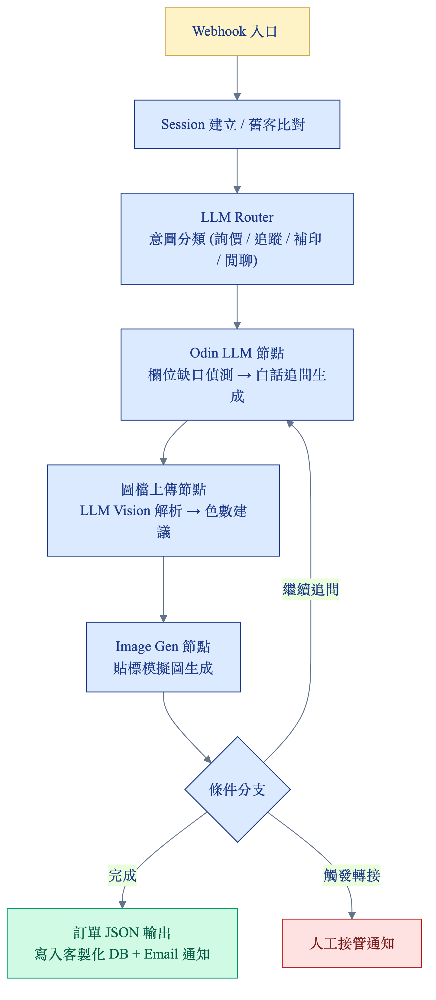{ width=60% }

Odin 處理器類型使用：
- **LLM 節點**：對話生成、意圖識別、欄位提取
- **HTTP 節點**：Email 通知、Webhook 接收
- **Router 節點**：意圖分流、條件觸發
- **SQL 節點**：客戶資料庫查詢
- **MCP 節點**：圖像生成 API 串接

### 客製化開發（前後端 + AI 整合層）

本次 POC 由 Asgard AI 提供客製化開發資源，承擔以下原本可由 Sindri 提供的功能：

- **意圖識別 / 欄位缺口偵測 / 話術生成**：以 Odin LLM 節點 + 客製化 Python/Node 程式實作
- **舊客識別與帶入**：客製化 API 查詢基本 DB，將歷史訂單帶回對話流
- **情緒偵測 + 真人轉接**：Odin LLM 節點分類 + 客製化通知（Email / LINE Webhook）
- **AI 模擬圖串接**：Odin Image Gen 節點 + 客製化前端展示
- **嵌入式 Chatbot 前端**：React 元件，可內嵌至杰隆官網

Phase 2 階段可升級為 **Sindri Agent Hub** 的多 Agent 編排，獲得更強的對話狀態管理與 Agent 協作能力。

### 基本 DB / AP Server（資料層）

本次 POC 由 Asgard AI 協助搭建基本資料層，承擔以下原本可由 Mimir 提供的功能：

- **訂單草稿 DB**：結構化儲存對話完成後的訂單需求
- **客戶資料 DB**：Email / 電話索引，支援舊客查詢
- **對話紀錄 DB**：完整對話 log，供後續分析與訓練
- **AP Server**：後端 API、Session 管理、容器化部署、基本監控

Phase 2 階段可升級為 **Mimir Data Insight**，獲得儀表板、跨來源資料整合與決策建議能力。

### Phase 2 進階擴展（本次 POC 不含，列為未來規劃）

POC 上線並穩定後，可逐步導入 Asgard 平台的進階模組：

| 模組 | 升級價值 | 觸發時機 |
|------|---------|---------|
| **Sindri Agent Hub** | 多 Agent 並行協作、跨對話記憶、Agent 間任務交接，提升複雜詢價案件的對話品質 | 散客量 > 50/日、需處理多步驟詢價時 |
| **Mimir Data Insight** | 訂單轉換漏斗、客群分析、材質偏好趨勢儀表板，輔助業務決策 | 累積 3 個月以上歷史訂單後 |

Phase 2 採另行報價。

---

## 訂單欄位與材質對照表

### A 類必問欄位（14 項）完整規格

| # | 欄位名稱 | 收集目的 | AI 白話引導話術 | 備註 |
|---|---------|---------|--------------|------|
| 1 | 品名 | 識別訂單 | 「請問這張貼紙是用在什麼產品上呢？」 | 同時推斷容器類型 |
| 2 | 尺寸 | 計算用料 | 「貼紙大概是幾公分寬、幾公分高呢？」 | 成捲需確認出紙方向 |
| 3 | 數量/PCS | 報價基礎 | 「這次大概需要印幾張呢？」 | 影響單價區間 |
| 4 | 材質 | 工法與用料 | 「您希望貼紙是亮面的、霧面的，還是有特殊質感（如銀色金屬感）？」 | **限官網 8 種材質** |
| 5 | 色數 | 估算印刷成本 | AI 從設計稿解析，或問：「設計上有幾個顏色？有沒有特別調配的專色？」 | CMYK + 特色數量 |
| 6 | 成捲/單張 | 後加工方式 | 「這批貼紙要裁成一張一張，還是捲成一卷（方便機器自動貼）？」 | 捲需定義捲向 |
| 7 | 是否軋型 | 是否需刀模 | 「貼紙的形狀是長方形、圓形，還是需要特別裁切成產品的輪廓形狀？」 | 非方形需刀模費 |
| 8 | 出貨日期 | 排定生產優先序 | 「您希望什麼時候可以收到貨呢？」 | 影響排程 |
| 9 | 交貨方式 | 物流安排 | 「請問要送貨到府，還是您會自行來取？」 | 含物流廠商選擇 |
| 10 | 收件人/地址/電話 | 送貨資訊 | 「最後請留下收件人姓名、地址和聯絡電話，我們安排出貨用。」 | ★  個資需加密保護 |
| 11 | 發票抬頭 | 開立統一發票 | 「發票要開給哪個公司行號呢？」 | B2B 必問 |
| 12 | 客戶生產單號 | 大客戶內部追蹤 | 「您們公司有沒有自己的採購單號或生產單號需要我們標注？（沒有的話也沒關係）」 | 中小客戶可略過 |
| 13 | 客戶料號 | 對應客戶編碼 | 「這款貼紙在您們系統裡有沒有對應的料號？」 | 大客戶通常有 |
| 14 | 接單日期 | 訂單時間追蹤 | 系統自動填入 | 不問客戶 |

> ★  個資保護：收件人姓名、地址、電話（欄位 10）屬於個人敏感資訊，資料儲存需加密，AI 不得在後續對話中顯示或重複輸出這些資訊。

### B 類條件欄位（7 項）

| # | 欄位名稱 | 觸發條件 | AI 引導話術 |
|---|---------|---------|------------|
| B1 | 圓角 | 有提到形狀或裁切 | 「貼紙的四個角要圓一點嗎？還是直角就好？」 |
| B2 | 亮/霧膜 | 有提到表面質感 | 「表面要亮面（反光）還是霧面（低調）？」 |
| B3 | 燙金色號/尺寸 | 提到金色/銀色/反光 | 「有需要燙上金色或銀色的反光效果嗎？如果有，大概在哪個位置？」 |
| B4 | 打凸 | 提到立體感 | 「有需要讓某個部分凸起來，形成立體觸感嗎？」 |
| B5 | 成樣方式 | 出貨形式不標準時 | 「這批貼紙出貨時要怎麼包裝或分裝呢？」 |
| B6 | 模擬圖打樣 | 收集欄位 50%+ | 「要不要先看看貼在產品上的模擬效果圖呢？」 |
| B7 | 備註 | 對話中有特殊需求 | 「還有其他需要特別說明的嗎？」 |

---

## 驗收標準

### 功能驗收項目

| 驗收項目 | 通過標準 |
|---------|---------|
| 完整詢價對話流 | AI 能從零引導收集完 A 類全部 14 項欄位，無需客戶主動說明術語 |
| 材質約束 | AI 在材質選擇時只推薦官網 8 種材質，不出現其他材料名稱 |
| 舊客識別 | 輸入已知 Email 或電話後，正確帶入歷史訂單資料 |
| 模擬圖生成 | 上傳設計稿 + 提供容器類型後，30 秒內輸出可預覽模擬圖 |
| 情緒轉接 | 模擬負面情緒輸入，觸發業務通知 Email |
| 訂單草稿輸出 | 對話完成後輸出符合 Excel 欄位格式的結構化 JSON |
| 多語言 | 輸入英文詢價，AI 正確理解並以中文 / 英文回應 |

### 非功能驗收項目

| 驗收項目 | 標準 |
|---------|------|
| 回應時間 | 每輪對話回應 < 3 秒 |
| 個資保護 | 收件人等敏感欄位不在對話記錄中明文顯示 |
| 對話長度 | 新客完成所有 A 類欄位收集 ≤ 15 輪對話 |
| 回頭客效率 | 補印同款 ≤ 3 輪對話完成確認 |

---

## 時程規劃

### POC 三週衝刺計畫

| 週次 | 主要工作 | 交付物 |
|------|---------|-------|
| **Week 1** | 知識庫建置、Odin 工作流設計 | 材質知識庫、欄位定義 JSON、對話流 Demo |
| **Week 2** | Odin 工作流 + 客製化欄位引導引擎開發 | 完整詢價對話可運行、舊客識別功能 |
| **Week 3** | 模擬圖生成串接、前端嵌入、整合測試 | 網頁嵌入式 Chatbot、驗收演示 |

### 階段性里程碑

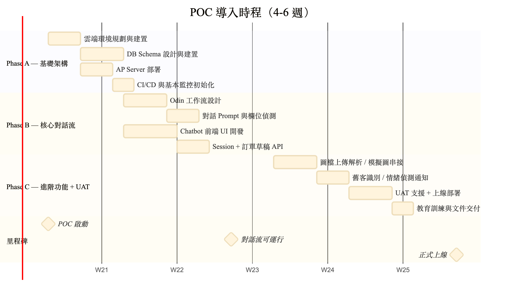{ width=72% }

### Phase 2 規劃（POC 後）

| 功能 | 預估時間 |
|-----|---------|
| LINE 官方帳號整合 | +2 週 |
| 自動報價計算引擎 | +3 週（需杰隆提供定價邏輯） |
| 完全自動訂單成立（標準規格） | +4 週 |
| 管理後台（數據儀表板） | +3 週 |

---

## 預期效益

### 量化效益預估

| 指標 | 現況 | 導入 AI 後 | 改善幅度 |
|------|------|----------|---------|
| 詢價到完成資訊收集 | 0.5～3 天 | **< 15 分鐘** | 減少 95%+ |
| 非上班時間詢價接單率 | 0% | **100%（AI 接線）** | +100% |
| 業務人員重複確認規格時間 | 高 | 降低（AI 完整收集） | 估減少 60%+ |
| 回頭客補印對話輪數 | 多次往返 | **≤ 3 輪** | 效率提升 80%+ |
| 跨時區客戶服務覆蓋 | 無 | **24/7 自動接線** | 新增能力 |

### 質化效益

- **客戶體驗**：不需懂印刷術語，用白話就能完成下單
- **業務人員**：從重複性資訊收集解放，專注於議價與客戶關係
- **管理層**：對話紀錄和訂單草稿完整保存，可用於品質分析與訓練
- **跨國業務**：英文詢價自動處理，拓展海外客源

---

## 待確認事項

以下問題需要在啟動會議中與杰隆團隊確認：

| # | 問題 | 背景說明 | 建議 |
|---|------|---------|------|
| 1 | MVP 第一個上線管道？ | 網頁聊天框 vs. LINE 官方帳號 | 建議先網頁，快速驗證後加 LINE |
| 2 | 圖檔上傳功能是否列入 POC？ | 技術複雜度較高，但對中小客戶吸引力大 | 建議列入，是差異化亮點 |
| 3 | 情緒偵測轉接的觸發閾值 | 連續幾次負面 → 轉接？ | 建議先設為「連續 2 次明確不滿」 |
| 4 | 自動轉接門檻（金額/規格） | 高金額或超規格時 AI 轉人工的條件 | 需杰隆定義：金額上限、特殊規格列表 |
| 5 | 現有 Excel 訂單表整合方式 | 詢價單寫入 Excel 還是新系統？ | 建議 POC 階段輸出 JSON，業務可匯入 |
| 6 | 業務通知方式 | Email 還是 LINE 群組通知？ | 建議雙管道，Email 為主、LINE 為輔 |
| 7 | 知識庫維護責任 | 材料更新、FAQ 維護由誰負責？ | 建議業務主管 + Asgard AI 定期優化 |

---

## 附錄 A：對話流程圖（文字版） {-}

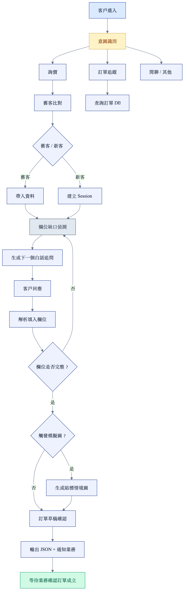{ width=55% }

---

## 附錄 B：訂單草稿 JSON Schema {-}

```json
{
  "order_draft": {
    "session_id": "string",
    "created_at": "ISO8601",
    "channel": "web | line | email",
    "customer": {
      "phone": "string (encrypted)",
      "email": "string",
      "is_returning": "boolean",
      "previous_order_id": "string | null"
    },
    "fields_a": {
      "品名": "string",
      "尺寸_寬mm": "number",
      "尺寸_高mm": "number",
      "數量_PCS": "number",
      "材質": "enum: [銅版紙, 亮面珠光, 霧面珠光紙, 亮銀龍貼紙, 反銀龍貼紙, 模造紙, 透明標籤, 日本和紙]",
      "色數": "number",
      "成捲_單張": "enum: [裁張, 正捲右出, 正捲左出, 正捲下出]",
      "是否軋型": "boolean",
      "出貨日期": "ISO8601 date",
      "交貨方式": "enum: [客戶親取, 新竹物流, 郵局, 專車]",
      "收件人": "string (encrypted)",
      "地址": "string (encrypted)",
      "聯絡電話": "string (encrypted)",
      "發票抬頭": "string",
      "客戶生產單號": "string | null",
      "客戶料號": "string | null",
      "接單日期": "ISO8601 date (auto)"
    },
    "fields_b": {
      "圓角": "string | null",
      "亮霧膜": "enum: [亮膜, 霧膜, 無] | null",
      "燙金色號": "string | null",
      "燙金位置": "string | null",
      "打凸": "boolean | null",
      "成樣方式": "string | null",
      "備註": "string | null"
    },
    "mockup_image_url": "string | null",
    "design_file_url": "string | null",
    "completion_rate": "number (0-1)",
    "needs_human_review": "boolean",
    "handoff_reason": "string | null"
  }
}
```

---

*文件由 Asgard AI 顧問團隊製作。本提案內容依據杰隆印刷官網資料、需求訪談文件及現有訂單追蹤表整理而成。*

*© 2026 Asgard AI — Confidential*


## 附錄 C：Demo 操作截圖 {-}

下列截圖摘錄自實際運行的 POC Demo（`index.html`），呈現一次完整的「保養品瓶標」詢價流程，從歡迎畫面一路到結構化訂單輸出。

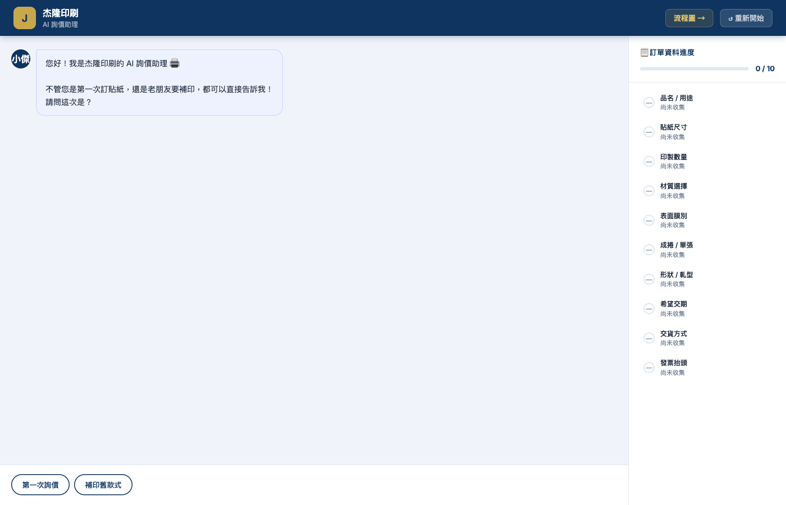{ width=72% }

\vspace{0.2em}

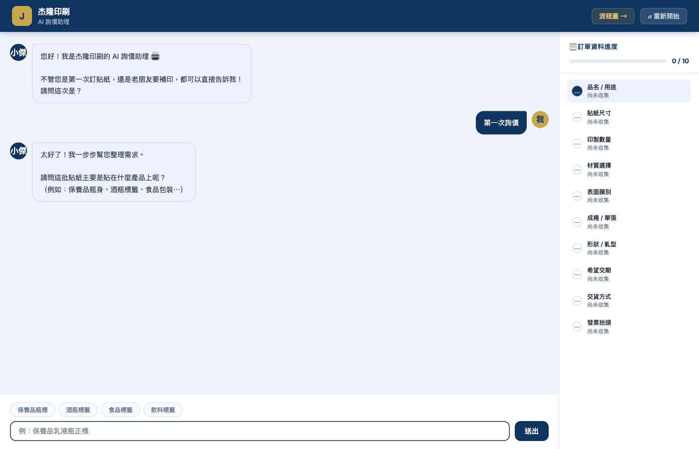{ width=72% }

\vspace{0.2em}

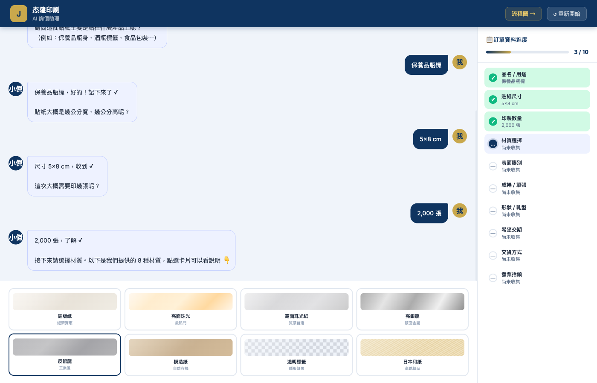{ width=72% }

\vspace{0.2em}

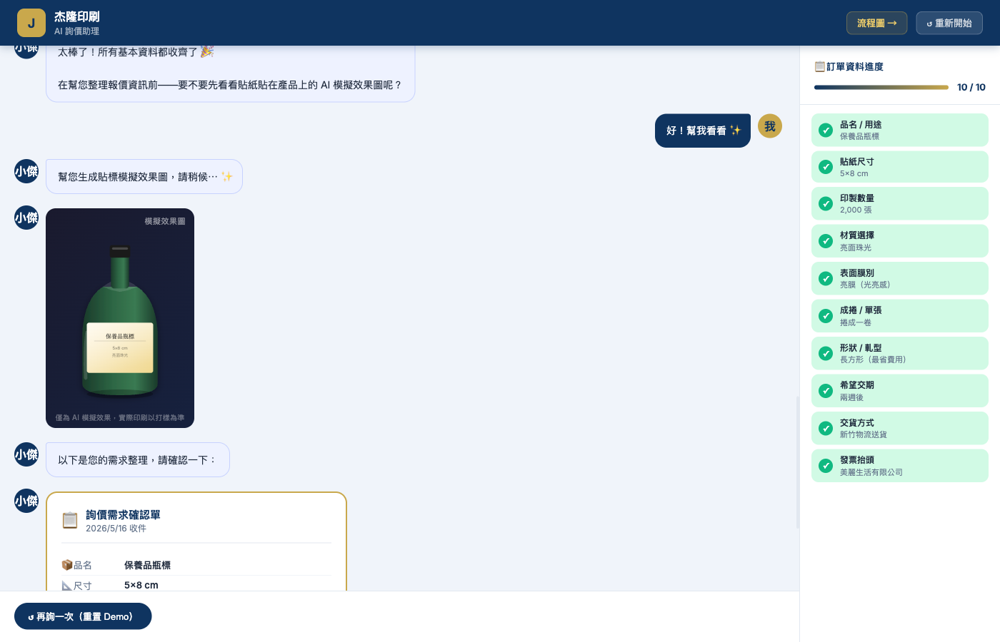{ width=72% }

\vspace{0.2em}

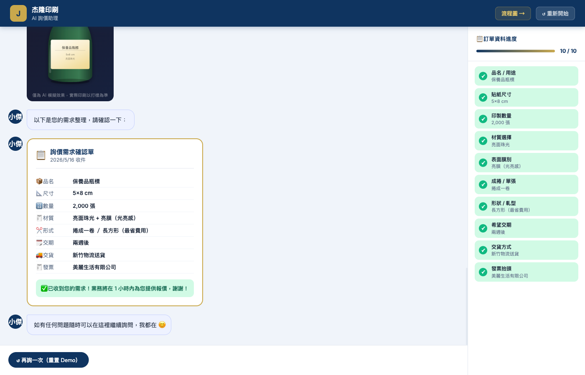{ width=72% }


## 附錄 D：POC 報價單明細 {-}

### D.1　Asgard 平台訂閱費（持續性月費，與下方一次性費用分開計算） {-}

| 方案 | 月費 | 規格 |
|------|------|------|
| **Basic-Lite**（本次推薦） | NT$ 20,000 / 月 | 1 Agent Hub user、1 Data Insight user、1,000 Asgard Credits |

**付款方式（擇一）：**

| 選項 | 金額 | 備註 |
|------|------|------|
| □　信用卡月扣 | NT$ 20,000 / 月 | 每月自動扣款 |
| □　年付開立發票 | NT$ 240,000 / 年 | 一次開立，預付一年 |

> 依正式上線使用量可升級至 Regular（NT$ 50,000 / 月）或 Plus（NT$ 100,000 / 月）。

### D.2　一次性 POC 導入服務（4-6 週，單價 NT$ 20,000 / 人天） {-}

#### W1-W2　Phase A：基礎架構 + DB Schema + AP Server 部署 {-}

| 項目 | 工作內容 | 人天 | 小計 |
|------|---------|:---:|---:|
| 雲端環境規劃與建置 | GCP / AWS 帳號、VPC、IAM、Secret 管理 | 0.5 | NT$ 10,000 |
| DB Schema 設計與建置 | 訂單草稿 / 客戶 / 對話紀錄 / 知識庫 | 1 | NT$ 20,000 |
| AP Server 部署 | 容器化、反向代理、TLS 設定 | 1 | NT$ 20,000 |
| CI/CD 與基本監控初始化 | GitHub Actions、Log / Error 監控 | 0.5 | NT$ 10,000 |
| **Phase A 階段小計** | | **3** | **NT$ 60,000** |

#### W3-W4　Phase B：核心對話流 + Odin 工作流建置 {-}

| 項目 | 工作內容 | 人天 | 小計 |
|------|---------|:---:|---:|
| Odin 工作流設計 | 接單主流程、條件分支、轉接邏輯 | 1 | NT$ 20,000 |
| 對話 Prompt 與欄位偵測邏輯 | LLM Prompt、缺口偵測、白話追問 | 1 | NT$ 20,000 |
| Chatbot 前端 UI 開發 | 嵌入式對話框、訊息流、模擬圖預覽 | 1 | NT$ 20,000 |
| Session 管理 + 訂單草稿 API | Session、訂單 JSON schema、後端 API | 1 | NT$ 20,000 |
| **Phase B 階段小計** | | **4** | **NT$ 80,000** |

#### W5-W6　Phase C：進階功能 + UAT + 教育訓練 {-}

| 項目 | 工作內容 | 人天 | 小計 |
|------|---------|:---:|---:|
| 圖檔上傳解析 | LLM Vision 串接、色數與尺寸建議 | 0.5 | NT$ 10,000 |
| AI 模擬圖生成 | Image Gen API 串接、情境圖輸出 | 0.5 | NT$ 10,000 |
| 舊客識別查詢 | Email / 電話比對、歷史訂單帶入 | 0.5 | NT$ 10,000 |
| 情緒偵測 + 真人轉接通知 | 情緒分類、Email / LINE Webhook | 0.5 | NT$ 10,000 |
| UAT 支援 + 上線部署 | Bug 修正、上線切換、煙霧測試 | 0.5 | NT$ 10,000 |
| 教育訓練與文件交付 | 業務操作訓練、技術交接文件 | 0.5 | NT$ 10,000 |
| **Phase C 階段小計** | | **3** | **NT$ 60,000** |

### D.3　Phase 2 進階模組（另行報價，不計入本次總價） {-}

| 模組 | 升級價值 | 費用 |
|------|---------|------|
| Sindri Agent Hub | 多 Agent 並行協作、跨對話記憶、複雜詢價對話品質升級 | 另行報價 |
| Mimir Data Insight | 訂單轉換漏斗、客群分析、材質偏好趨勢儀表板 | 另行報價 |

### D.4　一次性 POC 導入服務 加總 {-}

| 項目 | 金額 |
|------|---:|
| 一次性導入服務小計（未稅） | NT$ 200,000 |
| 營業稅 5% | NT$ 10,000 |
| **含稅總價** | **NT$ 210,000** |

> ★ 本份總價僅為 POC 一次性導入服務費用；Asgard 平台訂閱費另計（見 D.1 區）。

### D.5　假設與排除 {-}

1. 不含杰隆印刷既有 ERP / 生產系統的整合與對接
2. 不含 LINE 官方帳號 / FB Messenger 等通道串接（Phase 2 規劃）
3. 不含自動報價計算邏輯（需杰隆提供定價模型）
4. 雲端基礎設施費用（GCP / AWS）由客戶以實際使用量支付

### D.6　付款條件與有效期 {-}

- **付款條件建議**：簽約 30% / 中期驗收 40% / 最終驗收 30%
- **報價有效期**：自報價日起 30 日
- **本次報價日期**：2026-05-16
